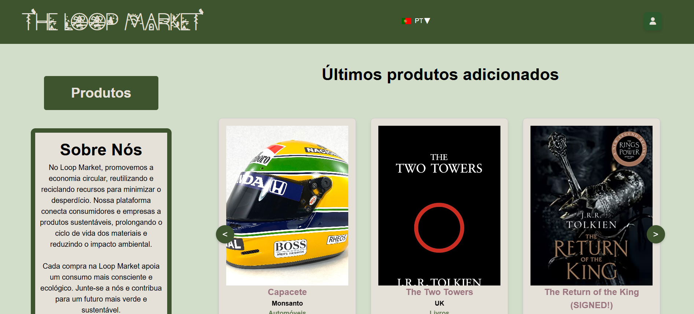
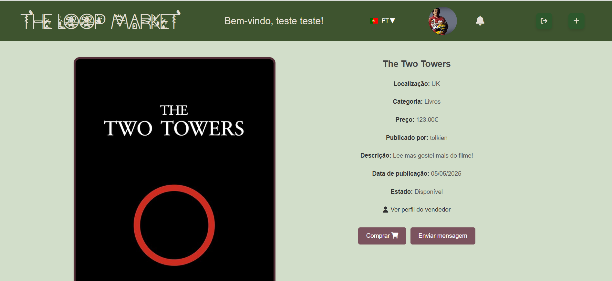
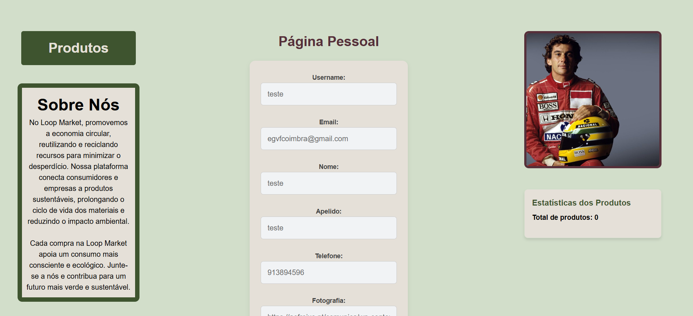

# 🛒 Marketplace Platform

> A modern full-stack marketplace application built with **Java (Jakarta EE)** and **React**, featuring secure authentication, real-time messaging, live notifications and multilingual support.



## ✨ Highlights

- 🔐 Secure authentication with token-based sessions
- 💬 Real-time chat using WebSockets
- 🔔 Live notifications
- 🛒 Complete marketplace workflow
- 👤 Public & private user profiles
- ⭐ Seller evaluations
- 📊 Administration dashboard with statistics
- 🌍 Internationalization (Portuguese, English and French)

## 🛠 Tech Stack

### Backend

- Java 21
- Jakarta EE 10
- JAX-RS
- JPA / Hibernate
- WebSockets
- BCrypt
- Log4j
- Maven
- WildFly
- JUnit & Mockito

### Frontend

- React
- React Router
- Zustand
- react-intl
- Bootstrap / React Bootstrap
- Recharts

### Database

- PostgreSQL

## 🏗 Architecture

```text
                          React Frontend
                                 │
                                 │
                    REST API + WebSockets
                                 │
                                 ▼
                   Jakarta EE Backend (WildFly)
                                 │
        ┌──────────────┬───────────────┬──────────────┐
        │              │               │              │
     Services       Business        WebSockets      Config
                     Beans
        │              │
        └──────────────┘
               │
              DAOs
               │
          JPA / Hibernate
               │
          PostgreSQL
```

The backend follows a layered architecture separating REST resources, business logic, persistence and real-time communication. The frontend is organised into reusable components, pages, hooks, stores and API modules.

## 📂 Project Structure

```text
marketplace/
│
├── backend/
│   ├── bean/
│   ├── config/
│   ├── dao/
│   ├── dto/
│   ├── entity/
│   ├── exception/
│   ├── init/
│   ├── service/
│   ├── util/
│   └── websocket/
│
├── proj5_frontend/
│   ├── api/
│   ├── components/
│   ├── hooks/
│   ├── pages/
│   ├── stores/
│   ├── translations/
│   ├── utils/
│   └── websocket/
│
└── README.md
```

## 📸 Screenshots






## 🚀 Installation

### Prerequisites

- Java 21
- Maven
- PostgreSQL
- WildFly
- Node.js
- npm

### Clone the repository

```bash
git clone https://github.com/dpassos91/marketplace.git
cd marketplace
```

### Backend

```bash
cd backend
mvn clean package
```

Deploy the generated WAR file to WildFly and configure the datasource:

```text
java:/postgresDS
```

### Frontend

```bash
cd proj5_frontend
npm install
npm start
```

## ⭐ Technical Highlights

- Layered backend architecture
- DTO and DAO patterns
- Exception mappers
- Token-based authentication
- Password hashing with BCrypt
- WebSocket-based real-time communication
- Zustand state management
- Internationalization with react-intl
- PostgreSQL persistence through JPA/Hibernate

## 📚 What I Learned

Building this application strengthened my understanding of full-stack application development, layered architectures, REST APIs, authentication, frontend/backend integration and real-time communication.

More importantly, it taught me how to organise a growing codebase into maintainable and reusable components while keeping responsibilities clearly separated.

## 🔭 Future Improvements

- Docker support
- CI/CD with GitHub Actions
- OpenAPI / Swagger documentation
- OAuth authentication
- Payment gateway integration
- Cloud image storage
- Improved automated testing
- Performance optimisations

---

Originally developed as a project of the **Java Fullstack Development Programme** (Acertar o Rumo - Universidade de Coimbra).

